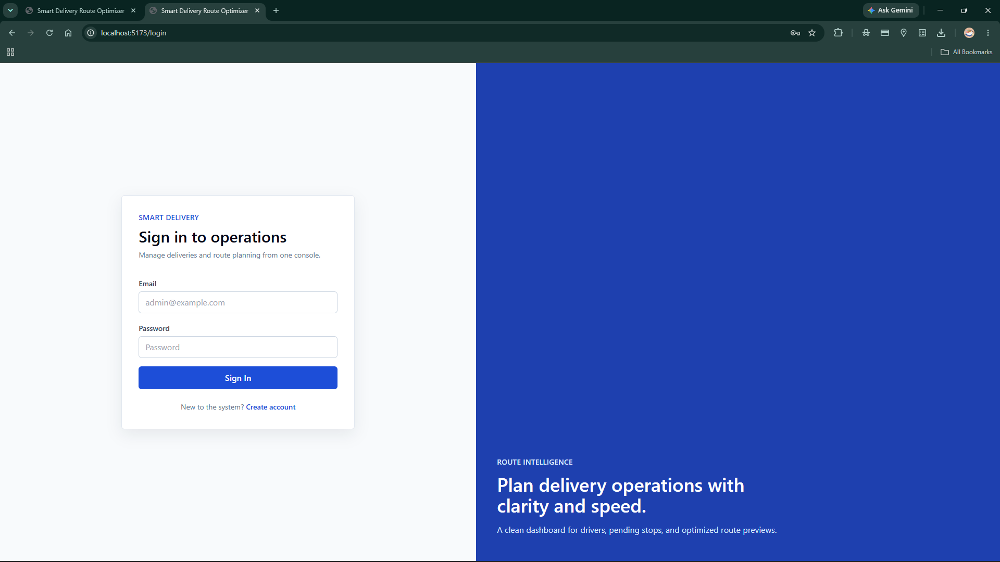
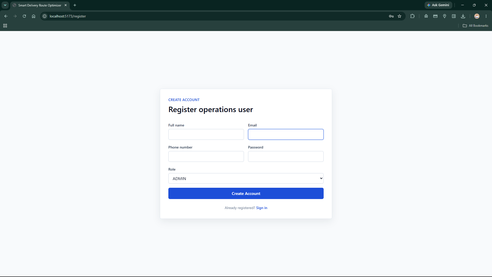
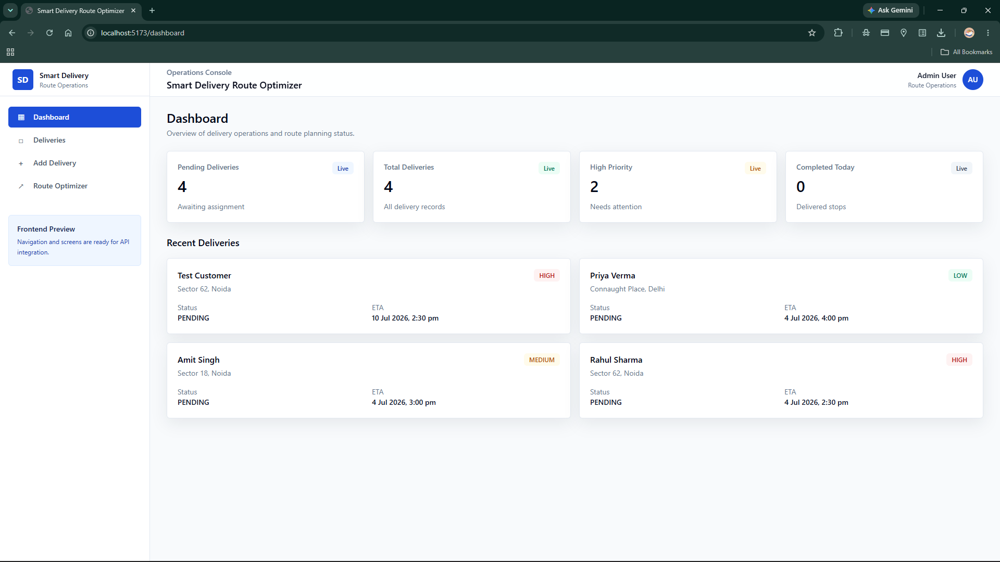
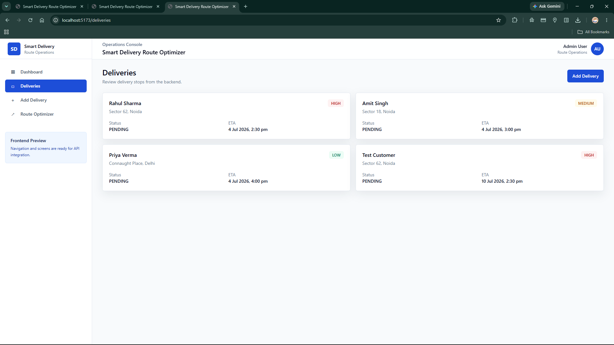
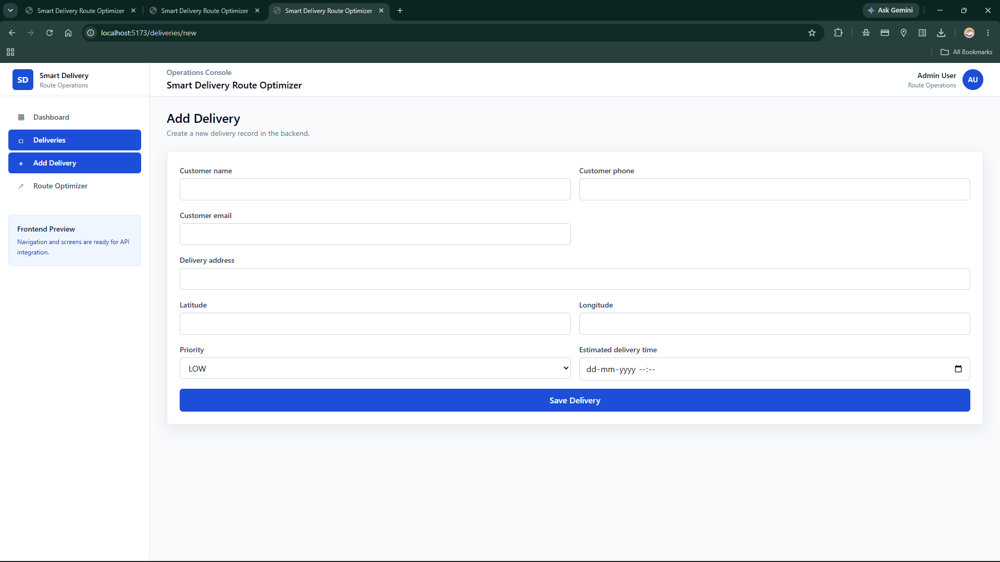
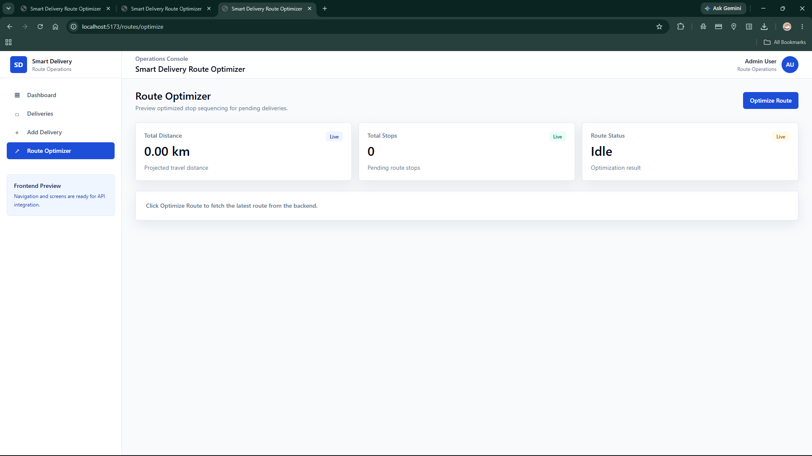
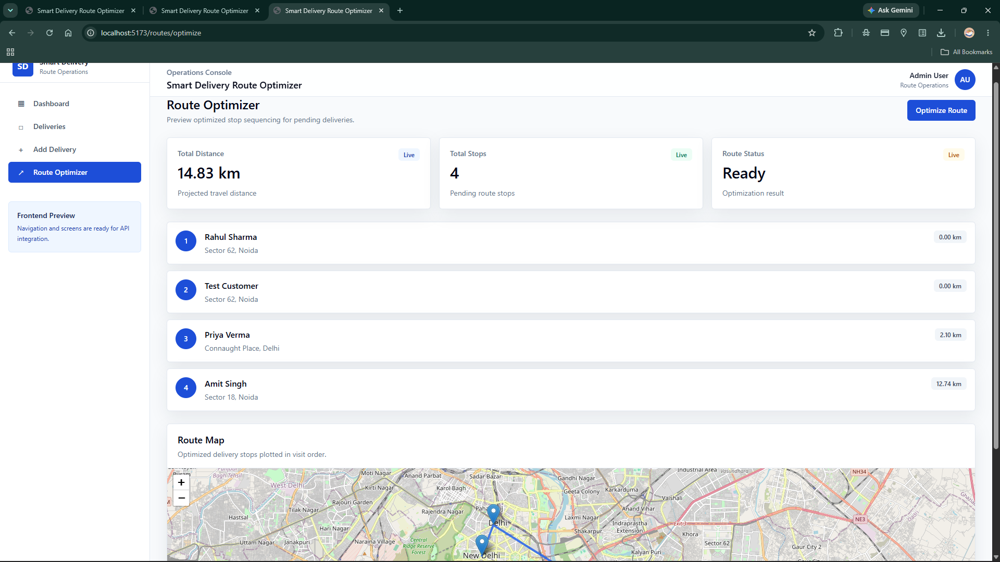

# 🚚 Smart Delivery Route Optimizer

A full-stack web application that optimizes delivery routes using Graph Theory and Dijkstra's Shortest Path Algorithm. The system helps delivery administrators manage deliveries, visualize optimized routes on an interactive map, and improve delivery efficiency.

---

## 📌 Features

### 🔐 Authentication
- User Registration
- User Login
- BCrypt Password Encryption
- Spring Security Basic Authentication

### 📦 Delivery Management
- Add Delivery
- View Deliveries
- Update Delivery
- Delete Delivery

### 🗺 Route Optimization
- Graph-based delivery network
- Haversine Distance Calculation
- Dijkstra's Shortest Path Algorithm
- Optimized delivery sequence
- Interactive OpenStreetMap visualization

### 📊 Dashboard
- Total Deliveries
- Pending Deliveries
- High Priority Deliveries
- Completed Deliveries
- Recent Deliveries

---

## 🛠 Tech Stack

### Backend
- Java 25
- Spring Boot 3
- Spring Security
- Spring Data JPA
- Hibernate
- MySQL
- Maven

### Frontend
- React 19
- Vite
- Tailwind CSS
- Axios
- React Router
- Leaflet
- OpenStreetMap

---

## 📂 Project Structure

```
Smart Delivery Route Optimizer
│
├── src/main/java
│   ├── controller
│   ├── service
│   ├── repository
│   ├── entity
│   ├── graph
│   ├── algorithm
│   └── route
│
├── src
│   ├── pages
│   ├── components
│   ├── services
│   └── layouts
│
└── pom.xml
```

---

## 🚀 How to Run

### Backend

```bash
git clone <repository-url>

cd Smart Delivery Route Optimizer

./mvnw spring-boot:run
```

Backend runs on

```
http://localhost:8080
```

---

### Frontend

```bash
npm install

npm run dev
```

Frontend runs on

```
http://localhost:5173
```

---

## 🗄 Database

MySQL Database

```
smart_delivery_route_optimizer
```

---

## REST APIs

### Authentication

```
POST /api/auth/register
POST /api/auth/login
```

### Deliveries

```
GET    /api/deliveries
POST   /api/deliveries
PUT    /api/deliveries/{id}
DELETE /api/deliveries/{id}
```

### Graph

```
GET /api/graph
```

### Route Optimization

```
GET /api/routes/optimize
```

---

## 🧠 Algorithms Used

- Graph Data Structure
- Haversine Distance Formula
- Dijkstra's Shortest Path Algorithm

---

## 🗺 Interactive Map

The optimized delivery route is displayed using:

- OpenStreetMap
- React Leaflet
- Polyline visualization
- Route markers

---

## 📸 Screenshots

### Login



### Register



### Dashboard



### Deliveries



### Add Delivery



### Route Optimizer



### Interactive Route Map



## 👨‍💻 Author

**Mohd Azaan Javed**

GitHub:
https://github.com/mohdazaanjaved-eng
